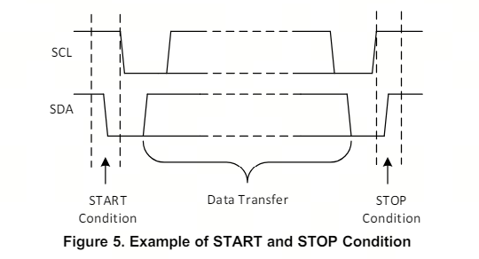
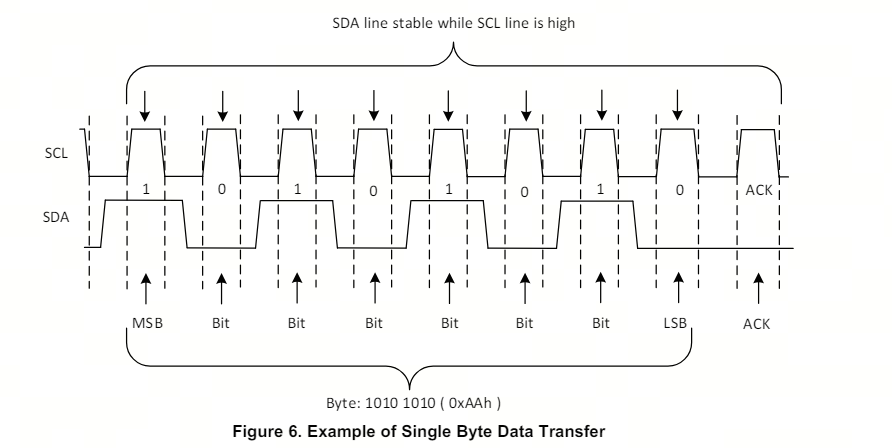

## I2C ——一种通讯协议
[[I2C资料]](https://www.ti.com/lit/an/slva704/slva704.pdf?ts=1713762347563)
> General IIC Operation （feature）

### 1. feature
1. 不同设备共享同一套I2C总线，具有不同地址
2. 从机只有在主机寻址到从机时才对主机进行数据传输（双端通讯，但是主机绝对主导）
3. 许多从属设备将需要在启动时进行配置，以设置设备的行为（需要预先配置）
4. IIC接口分为SCL和SDA两条线，均需要通过上拉电阻器连接Vcc
5. 总线空闲时才可以进行数据传输，而总线空闲的条件是stop condition之后双线拉高

* master send data to a slave
    
    * 发送START状态并且寻址
    * 发送数据
    * 发送STOP状态 

* master want to recv/read data from a slave

    * 发送START状态并且寻址
    * 发送请求的寄存器
    * 接受数据
    * 发送STOP状态

### 2. Transfer

#### 2.1 START Condition
* IIC通讯的初始化由master发送START条件开始
* SCL线保持高位
* SDA线由高到低

#### 2.2 Repeated START Condition
* 类似START Condition

#### 2.3 STOP Condition
* 每个字节（byte）后都会跟着一个来自接收方的ACK bit，表明成功接收数据
* 在

