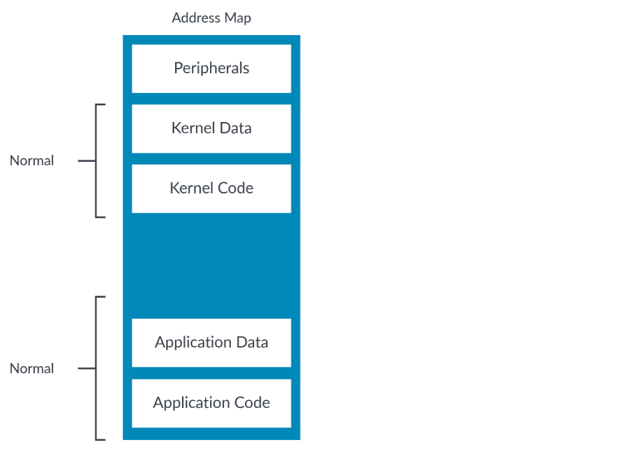
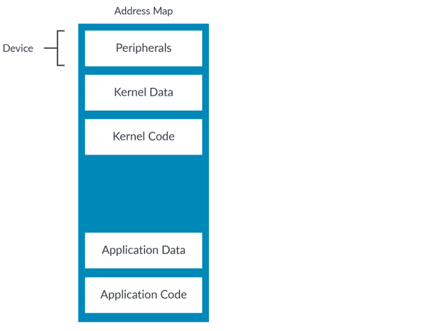

## Memory Types
aarch64 memory
> [链接](https://developer.arm.com/documentation/102376/0200/Device-memory)

#### 1. Normal memory

一般内存，任何行为类似内存的东西：RAM、ROM、FLASH 

* 可以看出kernel code/data, user code/data都是"normal memory"
* normal memory 意味着 read操作只会获得data，不会导致数据的改变或者trigger another process. 所谓的**no direct side-effect**
  * 合并访问
  * 预测访问
  * re-order access

#### 2. Device memory

设备内存，用于描述外设，（说白了就是寄存器地址映射到内存region？）

* 可以看出主要负责外设
* 不同于normal memory，是所谓的direct side-effects
* 举个例子，FIFO的读写就会导致数据位置的偏移，（读取指针前进？）所以说读取次数是需要严格确定的，否则会导致数据读取的偏差

> [next read](https://developer.arm.com/documentation/102376/0200/Device-memory/Sub-types-of-Device)

